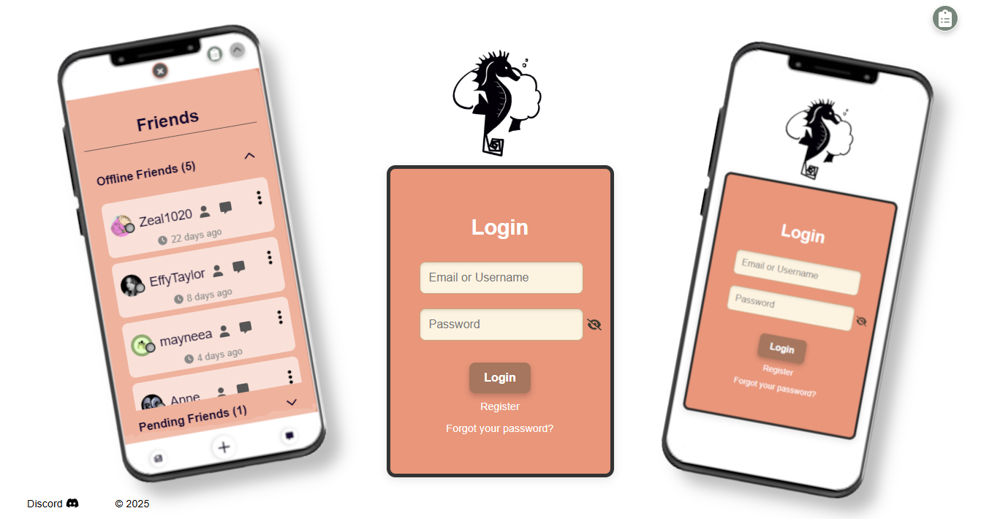
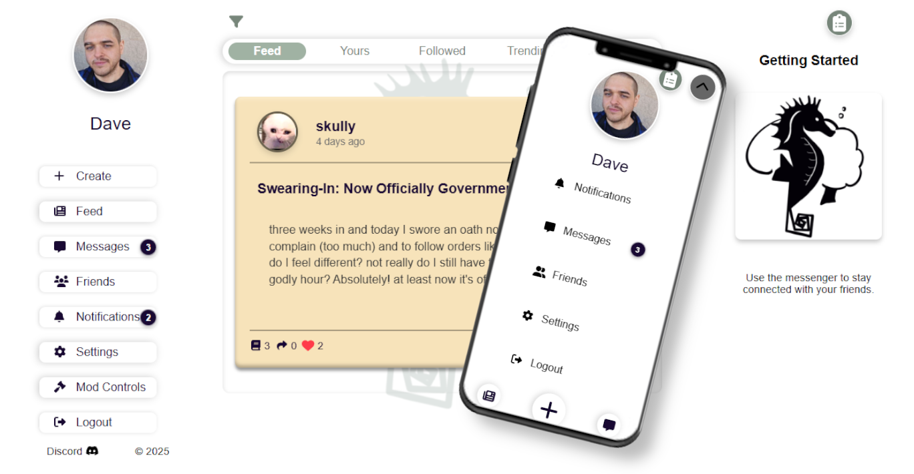
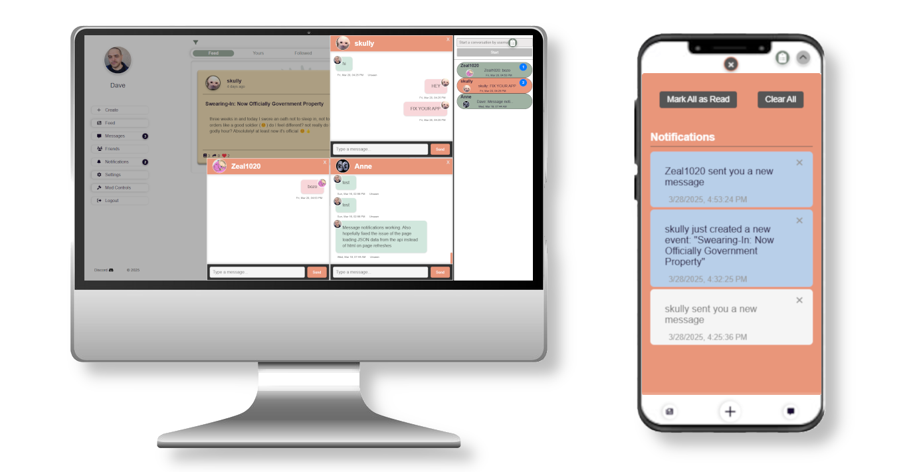

# Memory App

A social memory app designed to let users share, explore, and interact with memories and events. Features include real-time messaging, memory uploads, event participation, and a queryable feed system with infinite scrolling.

## A Polite Request

While not required by the license, if you use this project, a link back to the original repository would be greatly appreciated. It helps me grow as a developer and improves my career opportunities. Thank you for your support!

## Table of Contents
- [Features](#features)
- [Technologies Used](#technologies-used)
- [Project Structure](#project-structure)
- [Installation](#installation)
- [Usage](#usage)
- [Screenshots](#screenshots)
- [Live Demo](#live-demo)
- [Contributing](#contributing)
- [License](#license)

## Features
- User authentication (sign-up, login, logout) with password recovery via email
- User profile customization
- Rate limiting to prevent spam and abuse (Express Rate Limit)
- Memory creation with text and media uploads (images and videos)
- Google Vision API filtering for media moderation
- Manual media approval queue for profile pictures and public content
- Banning system for handling abusive users
- Friend system for connecting with other users
- Event creation and participation
- Infinite scrolling for feed with pagination
- Real-time messaging system (WebSocket-based)
- Notification system for invites, messages, and event updates
- Responsive design for mobile and desktop

## How It Works

Memory App is a social platform where users can share events and their personal memories of those events. Here's how it works:

###  Core Concepts
- **Events**: When you create an event, you provide a title, description, tags, and select a visibility level, and share your initial memory, which can include media. 
- **Memories**: To post an event, you must also share your memory of that event. This memory can include text, images, or videos to complement your post. Memories posted to the event will be blurred for users until they share their own memory of that event. This ensures that each memory shared is authentic, and unbiased by what others have shared.
- **Time Capsule Mode**: Events can be created with a **reveal date**, where all memories remain hidden until the specified reveal date.

### 📸 Example Use Cases
- **Friends at a concert - Private**: This could be a private, invite only event. It would not be publicly viewable, and meant for that friend group to share what they remembered collectively.
- **Big name concert attendance - Public**: This could be a public post regarding the same event, but rather than being intended for a small friend group, it could be posted with the intention of collecting memories of anyone who attended that public event. This can be recommended to other users from the trending tab or for you tab.
- **Friend group going off to college - Time Capsule Event - Private**: This event could be a private time capsule meant for a friend group, who would like to set a future date where they would all have their memories revealed to one another, so that they could reflect on what they remembered of the last day of that chapter of their lives together.
- **Collaborative Storytelling**: Multiple people contribute memories to a shared event to build a comprehensive story.

## Technologies Used
### Backend (Node.js / Express)
- Node.js
- Express
- PostgreSQL (Database)
- Cloudinary (Media Storage)
- WebSocket (WS Library) for real-time messaging
- Multer, Sharp, FFmpeg (Media processing)
- Google Vision API (Content Moderation)
- Axios (API requests)
- Bcrypt (Password hashing)
- Nodemailer (Email handling)
- Connect-pg-simple (Session store)
- Express Rate Limit (Rate Limiting)

### Frontend (React)
- React
- React Router DOM
- Axios (for API requests)
- FontAwesome (Icons)
- Bad Words Filter (Content filtering)
- DOMPurify (XSS Protection)

### Dev Tools
- Dotenv (Environment variable management)
- Tempy (Temporary file handling)

## Project Structure
```
root
├── client                     # Frontend code (React)
│   ├── public                 # Public files (e.g., index.html)
│   ├── src                    # React components and client-side code
│   │   ├── assets             # Static assets (e.g., images, icons)
│   │   ├── components         # All React components (including authentication)
│   │   ├── data               # Data fetching logic or constants
│   │   ├── hooks              # Custom React hooks
│   │   ├── styles             # CSS styles
│   │   ├── utils              # Helper functions (e.g., WebSocket handling)
│   │   └── index.jsx          # React entry point
|   └── package.json       # Frontend dependencies    
├── server                     # Backend code (Node.js, Express)
│   ├── config                 # Configuration files (e.g., database setup)
│   ├── public                 # Public files served by Express (e.g., media)
│   ├── utils                  # Utility functions
│   ├── server.js              # Express server setup
├── README.md                  # Project documentation
├── package.json               # Backend dependencies
├── client
├── .env.example               # Environment variable example file
├── Procfile                   # For Heroku deployment
├── .gitignore                 # Git ignore file
└── LICENSE                    # License file (MIT License)
```

## Installation

To get a local copy up and running, follow these steps:

1. **Clone the repository**:
```bash
git clone https://github.com/yourusername/your-repo-name.git
```

2. **Navigate to the project directory**:
```bash
cd your-repo-name
```

3. **Install dependencies for the backend**:
```bash
npm install
```

4. **Set up environment variables for the backend**:
- In the root folder, create a `.env` file based on the `.env.example` file provided.
- Fill in your own values.

5. **Install dependencies for the frontend**:
```bash
cd ../client
npm install
```

6. **Add server proxy to package.json in the client folder**:
Add the following line to the package.json to create a proxy for the server:
```json
"proxy": "http://localhost:4747"
```

## Usage

1. **Start the backend server**:
```bash
cd server
npm start
```
- This will start the backend server on the port specified in your `.env` file (default: 4747).

2. **Start the frontend development server**:
```bash
cd ../client
npm start
```
- This will start the React app, typically available at http://localhost:3000.

3. **Access the app**:
- Navigate to http://localhost:3000 to view the app.
- Make sure both the client and server are running simultaneously.

## Screenshots

### Login and Friendslist


### Navigation and Feed 


### Messenger and Notifications 


## Live Demo
Check out the live demo: [Memory App](https://memoryapp-d427aaf76968.herokuapp.com)

## Contributing

Contributions are welcome! Please open an issue or submit a pull request. To contribute:

Fork the repository

Create a feature branch (git checkout -b feature/YourFeatureName)

Commit your changes (git commit -m 'Add YourFeatureName')

Push to your branch (git push origin feature/YourFeatureName)

Create a Pull Request

All contributions will be reviewed before merging. Make sure your changes are well-documented and tested where applicable.

### A Polite Request to Contributors

If you fork or use this project, a link back to the original repository would be greatly appreciated. It helps me grow as a developer and improves my chances of getting hired. Thank you for your support!

## License

This project is licensed under the MIT License. See the LICENSE file for more details.

# Create React App Guide

This project was bootstrapped with [Create React App](https://github.com/facebook/create-react-app).

## Available Scripts

In the project directory, you can run:

### `npm start`

Runs the app in the development mode.\
Open [http://localhost:3000](http://localhost:3000) to view it in your browser.

The page will reload when you make changes.\
You may also see any lint errors in the console.

### `npm test`

Launches the test runner in the interactive watch mode.\
See the section about [running tests](https://facebook.github.io/create-react-app/docs/running-tests) for more information.

### `npm run build`

Builds the app for production to the `build` folder.\
It correctly bundles React in production mode and optimizes the build for the best performance.

The build is minified and the filenames include the hashes.\
Your app is ready to be deployed!

See the section about [deployment](https://facebook.github.io/create-react-app/docs/deployment) for more information.

### `npm run eject`

**Note: this is a one-way operation. Once you `eject`, you can't go back!**

If you aren't satisfied with the build tool and configuration choices, you can `eject` at any time. This command will remove the single build dependency from your project.

Instead, it will copy all the configuration files and the transitive dependencies (webpack, Babel, ESLint, etc) right into your project so you have full control over them. All of the commands except `eject` will still work, but they will point to the copied scripts so you can tweak them. At this point you're on your own.

You don't have to ever use `eject`. The curated feature set is suitable for small and middle deployments, and you shouldn't feel obligated to use this feature. However we understand that this tool wouldn't be useful if you couldn't customize it when you are ready for it.

## Learn More

You can learn more in the [Create React App documentation](https://facebook.github.io/create-react-app/docs/getting-started).

To learn React, check out the [React documentation](https://reactjs.org/).

### Code Splitting

This section has moved here: [https://facebook.github.io/create-react-app/docs/code-splitting](https://facebook.github.io/create-react-app/docs/code-splitting)

### Analyzing the Bundle Size

This section has moved here: [https://facebook.github.io/create-react-app/docs/analyzing-the-bundle-size](https://facebook.github.io/create-react-app/docs/analyzing-the-bundle-size)

### Making a Progressive Web App

This section has moved here: [https://facebook.github.io/create-react-app/docs/making-a-progressive-web-app](https://facebook.github.io/create-react-app/docs/making-a-progressive-web-app)

### Advanced Configuration

This section has moved here: [https://facebook.github.io/create-react-app/docs/advanced-configuration](https://facebook.github.io/create-react-app/docs/advanced-configuration)

### Deployment

This section has moved here: [https://facebook.github.io/create-react-app/docs/deployment](https://facebook.github.io/create-react-app/docs/deployment)

### `npm run build` fails to minify

This section has moved here: [https://facebook.github.io/create-react-app/docs/troubleshooting#npm-run-build-fails-to-minify](https://facebook.github.io/create-react-app/docs/troubleshooting#npm-run-build-fails-to-minify)